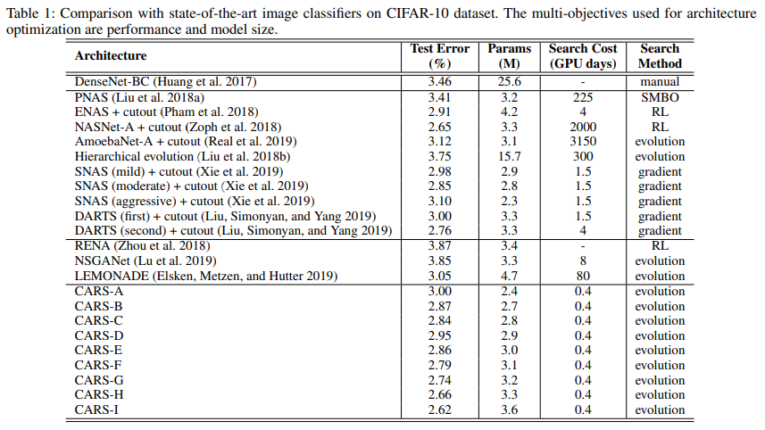
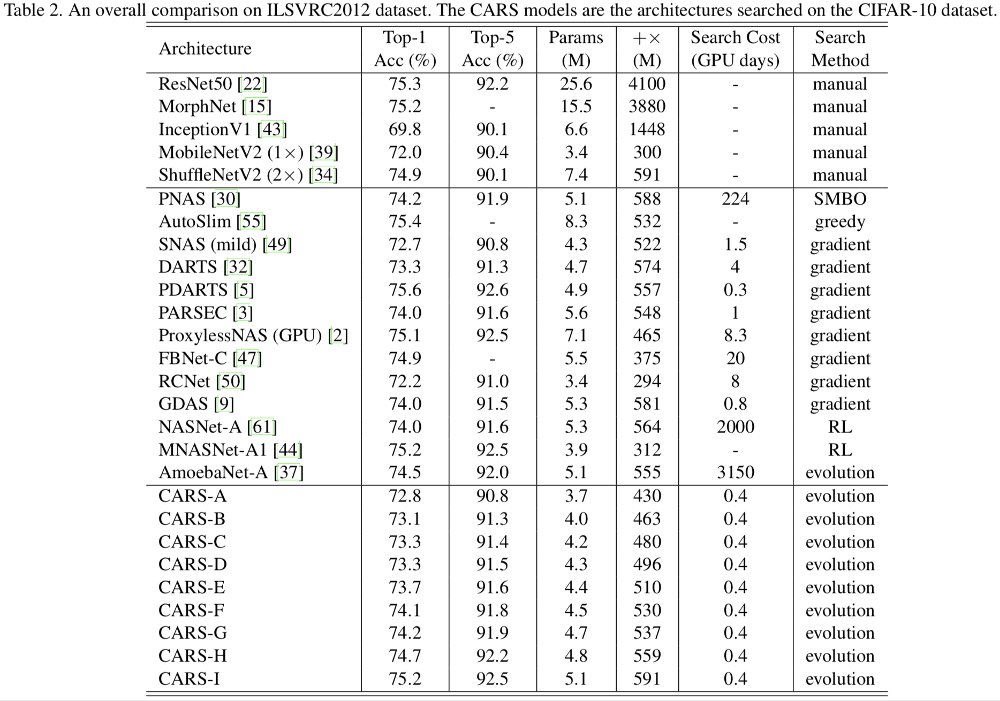
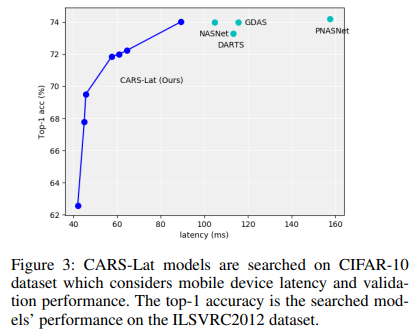

# CARS

[1] Zhaohui Yang, Yunhe Wang, Xinghao Chen, Boxin Shi, Chao Xu, Chunjing Xu, Qi Tian, and Chang Xu. [CARS: Continuous Evolution for Efficient Neural Architecture Search](https://arxiv.org/pdf/1909.04977.pdf). CVPR 2020.


## Introduction

This repository contains the supplementary material of CARS. All the searching and training codes have been embedded in Huawei AutoML pipeline and will be released together.


## Results and Architectures

CARS searches on the CIFAR-10 dataset, and evaluate on CIFAR-10 and ImageNet datasets. Multi-objectives are taken into consideration during searching.

### Objectives: Acc + Params

Results on the CIFAR-10 dataset.

<table border="0">
<tr>
    <td>
    
    </td>
</tr>
</table>

Results on the ImageNet dataset.

<table border="0">
<tr>
    <td>
    
    </td>
</tr>
</table>

```python

CARS_A = Genotype(normal=[('skip_connect', 0), ('sep_conv_5x5', 1), ('max_pool_3x3', 0), ('avg_pool_3x3', 1), ('max_pool_3x3', 0), ('max_pool_3x3', 1), ('sep_conv_3x3', 0), ('dil_conv_5x5', 2)], normal_concat=range(2, 6), reduce=[('avg_pool_3x3', 0), ('max_pool_3x3', 1), ('max_pool_3x3', 0), ('skip_connect', 1), ('max_pool_3x3', 0), ('dil_conv_5x5', 1), ('dil_conv_5x5', 0), ('skip_connect', 2)], reduce_concat=range(2, 6))

CARS_B = Genotype(normal=[('sep_conv_5x5', 0), ('dil_conv_3x3', 1), ('sep_conv_3x3', 0), ('avg_pool_3x3', 2), ('dil_conv_3x3', 0), ('max_pool_3x3', 1), ('avg_pool_3x3', 0), ('skip_connect', 1)], normal_concat=range(2, 6), reduce=[('sep_conv_5x5', 0), ('skip_connect', 1), ('sep_conv_3x3', 0), ('max_pool_3x3', 1), ('avg_pool_3x3', 0), ('avg_pool_3x3', 1), ('dil_conv_3x3', 3), ('max_pool_3x3', 0)], reduce_concat=range(2, 6))

CARS_C = Genotype(normal=[('sep_conv_5x5', 0), ('skip_connect', 1), ('skip_connect', 0), ('skip_connect', 1), ('skip_connect', 0), ('max_pool_3x3', 1), ('sep_conv_5x5', 0), ('sep_conv_3x3', 1)], normal_concat=range(2, 6), reduce=[('max_pool_3x3', 1), ('max_pool_3x3', 0), ('sep_conv_5x5', 0), ('sep_conv_5x5', 1), ('dil_conv_5x5', 0), ('max_pool_3x3', 1), ('sep_conv_5x5', 0), ('dil_conv_3x3', 1)], reduce_concat=range(2, 6))

CARS_D = Genotype(normal=[('sep_conv_5x5', 0), ('dil_conv_3x3', 1), ('skip_connect', 0), ('avg_pool_3x3', 1), ('skip_connect', 0), ('max_pool_3x3', 1), ('sep_conv_5x5', 0), ('sep_conv_3x3', 1)], normal_concat=range(2, 6), reduce=[('max_pool_3x3', 1), ('max_pool_3x3', 0), ('max_pool_3x3', 0), ('sep_conv_3x3', 1), ('dil_conv_5x5', 0), ('max_pool_3x3', 1), ('sep_conv_5x5', 0), ('dil_conv_3x3', 1)], reduce_concat=range(2, 6))

CARS_E = Genotype(normal=[('sep_conv_3x3', 0), ('sep_conv_3x3', 1), ('skip_connect', 0), ('sep_conv_3x3', 2), ('avg_pool_3x3', 1), ('sep_conv_3x3', 2), ('skip_connect', 3), ('skip_connect', 4)], normal_concat=range(2, 6), reduce=[('skip_connect', 0), ('dil_conv_3x3', 1), ('avg_pool_3x3', 0), ('skip_connect', 2), ('sep_conv_3x3', 2), ('max_pool_3x3', 0), ('avg_pool_3x3', 0), ('sep_conv_3x3', 4)], reduce_concat=range(2, 6))

CARS_F = Genotype(normal=[('skip_connect', 0), ('sep_conv_5x5', 1), ('sep_conv_5x5', 0), ('skip_connect', 2), ('sep_conv_5x5', 3), ('max_pool_3x3', 0), ('skip_connect', 0), ('sep_conv_3x3', 1)], normal_concat=range(2, 6), reduce=[('avg_pool_3x3', 0), ('sep_conv_5x5', 1), ('dil_conv_3x3', 0), ('dil_conv_5x5', 1), ('sep_conv_5x5', 1), ('skip_connect', 2), ('max_pool_3x3', 0), ('max_pool_3x3', 1)], reduce_concat=range(2, 6))

CARS_G = Genotype(normal=[('max_pool_3x3', 0), ('dil_conv_5x5', 1), ('sep_conv_3x3', 0), ('skip_connect', 1), ('dil_conv_5x5', 0), ('sep_conv_5x5', 1), ('avg_pool_3x3', 0), ('sep_conv_3x3', 1)], normal_concat=range(2, 6), reduce=[('max_pool_3x3', 0), ('sep_conv_3x3', 1), ('sep_conv_3x3', 0), ('sep_conv_5x5', 1), ('sep_conv_3x3', 0), ('skip_connect', 1), ('avg_pool_3x3', 0), ('dil_conv_3x3', 1)], reduce_concat=range(2, 6))

CARS_H = Genotype(normal=[('sep_conv_5x5', 0), ('sep_conv_3x3', 1), ('sep_conv_3x3', 0), ('dil_conv_5x5', 2), ('avg_pool_3x3', 0), ('skip_connect', 1), ('sep_conv_5x5', 2), ('max_pool_3x3', 0)], normal_concat=range(2, 6), reduce=[('sep_conv_5x5', 0), ('max_pool_3x3', 1), ('sep_conv_3x3', 0), ('skip_connect', 1), ('dil_conv_3x3', 2), ('max_pool_3x3', 0), ('sep_conv_5x5', 0), ('avg_pool_3x3', 3)], reduce_concat=range(2, 6))

CARS_I = Genotype(normal=[('sep_conv_3x3', 0), ('sep_conv_3x3', 1), ('skip_connect', 0), ('sep_conv_5x5', 1), ('skip_connect', 2), ('sep_conv_3x3', 3), ('sep_conv_3x3', 0), ('dil_conv_5x5', 4)], normal_concat=range(2, 6), reduce=[('dil_conv_3x3', 0), ('skip_connect', 1), ('max_pool_3x3', 0), ('max_pool_3x3', 2), ('skip_connect', 1), ('sep_conv_5x5', 3), ('dil_conv_3x3', 1), ('max_pool_3x3', 4)], reduce_concat=range(2, 6))

```

### Objectives: Acc + Latency

<table border="0">
<tr>
    <td>
    
    </td>
</tr>
</table>

```python

CARS_Lat_A = Genotype(normal=[('skip_connect',0),('max_pool_3x3',1),('avg_pool_3x3',0),('max_pool_3x3',1),('skip_connect',2),('skip_connect',3),('skip_connect',2),('skip_connect',3)],normal_concat=range(2,6),reduce=[('skip_connect',0),('sep_conv_5x5',1),('dil_conv_5x5',0),('max_pool_3x3',2),('skip_connect',0),('max_pool_3x3',1),('skip_connect',1),('avg_pool_3x3',4)],reduce_concat=range(2,6))

CARS_Lat_B = Genotype(normal=[('skip_connect',0),('skip_connect',1),('skip_connect',1),('dil_conv_3x3',2),('skip_connect',2),('skip_connect',3),('max_pool_3x3',0),('max_pool_3x3',2)],normal_concat=range(2,6),reduce=[('max_pool_3x3',0),('max_pool_3x3',1),('skip_connect',1),('max_pool_3x3',0),('sep_conv_3x3',0),('max_pool_3x3',1),('dil_conv_5x5',0),('avg_pool_3x3',2)],reduce_concat=range(2,6))

CARS_Lat_C = Genotype(normal=[('skip_connect',0),('avg_pool_3x3',1),('skip_connect',0),('skip_connect',1),('max_pool_3x3',1),('skip_connect',3),('dil_conv_3x3',2),('skip_connect',4)],normal_concat=range(2,6),reduce=[('skip_connect',0),('sep_conv_5x5',1),('avg_pool_3x3',1),('sep_conv_5x5',2),('max_pool_3x3',0),('max_pool_3x3',1),('dil_conv_5x5',2),('skip_connect',4)],reduce_concat=range(2,6))

CARS_Lat_D = Genotype(normal=[('sep_conv_3x3',0),('skip_connect',1),('skip_connect',0),('skip_connect',1),('skip_connect',1),('avg_pool_3x3',3),('dil_conv_3x3',2),('skip_connect',4)],normal_concat=range(2,6),reduce=[('dil_conv_5x5',0),('sep_conv_5x5',1),('avg_pool_3x3',1),('sep_conv_5x5',2),('max_pool_3x3',0),('max_pool_3x3',1),('dil_conv_5x5',2),('skip_connect',4)],reduce_concat=range(2,6))

CARS_Lat_E = Genotype(normal=[('dil_conv_5x5',0),('skip_connect',1),('skip_connect',1),('avg_pool_3x3',2),('skip_connect',1),('avg_pool_3x3',2),('skip_connect',0),('max_pool_3x3',1)],normal_concat=range(2,6),reduce=[('skip_connect',0),('dil_conv_3x3',1),('sep_conv_3x3',0),('sep_conv_3x3',2),('dil_conv_3x3',0),('avg_pool_3x3',3),('sep_conv_3x3',1),('sep_conv_5x5',2)],reduce_concat=range(2,6))

CARS_Lat_F = Genotype(normal=[('sep_conv_5x5',0),('skip_connect',1),('skip_connect',0),('avg_pool_3x3',1),('dil_conv_3x3',1),('max_pool_3x3',0),('skip_connect',0),('skip_connect',1)],normal_concat=range(2,6),reduce=[('sep_conv_5x5',0),('max_pool_3x3',1),('sep_conv_5x5',1),('skip_connect',2),('sep_conv_5x5',0),('sep_conv_5x5',1),('sep_conv_5x5',3),('dil_conv_3x3',4)],reduce_concat=range(2,6))

CARS_Lat_G = Genotype(normal=[('sep_conv_5x5',0),('skip_connect',1),('sep_conv_3x3',0),('sep_conv_5x5',2),('dil_conv_3x3',1),('max_pool_3x3',0),('skip_connect',0),('skip_connect',1)],normal_concat=range(2,6),reduce=[('sep_conv_5x5',0),('max_pool_3x3',1),('sep_conv_3x3',0),('avg_pool_3x3',2),('sep_conv_5x5',0),('sep_conv_5x5',1),('sep_conv_5x5',3),('dil_conv_3x3',4)],reduce_concat=range(2,6))
```
